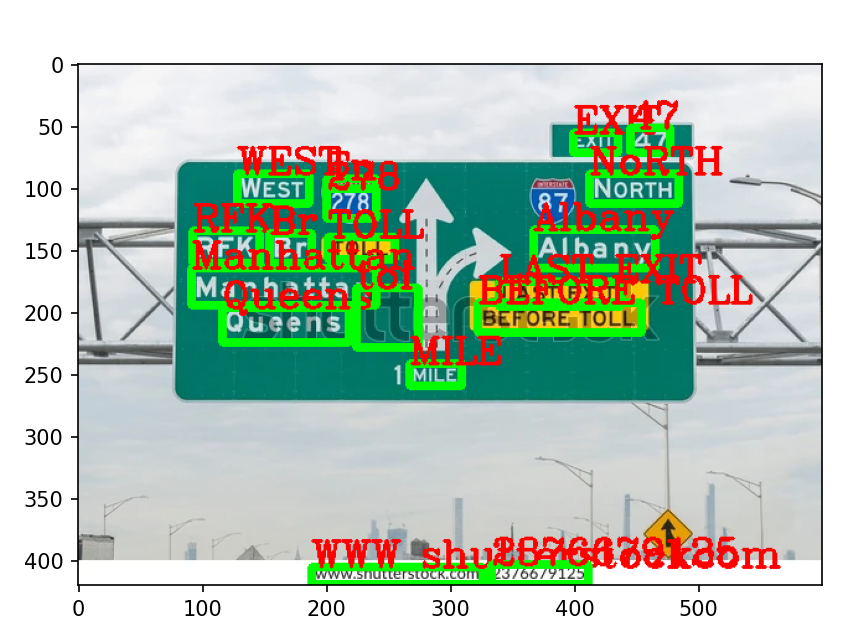

# 🧠 Text Detection from Image (OCR App)

This is a simple **Streamlit** web app that performs **Optical Character Recognition (OCR)** on images using **EasyOCR**. It extracts all visible text from an uploaded image and displays both:
- The annotated image with detected text boxes
- A list of all extracted text with confidence scores

---

## 🔍 Features

- ✅ Upload any image (`.png`, `.jpg`, `.jpeg`)
- 📦 Performs real-time text detection using [EasyOCR](https://github.com/JaidedAI/EasyOCR)
- 🖼️ Displays detected text over image
- 📝 Lists all detected text with confidence scores
- 🚀 Runs in browser using [Streamlit](https://streamlit.io/)

---

## 📸 Example

| Original Image | Output with Text Detection |
|----------------|-----------------------------|
|  |  |

---

## 🧑‍💻 How to Run

### 🖥️ Option 1: Run Locally

#### 1. Clone this repo or copy `app.py`:
```bash
git clone https://github.com/your-username/ocr-streamlit-app.git
cd ocr-streamlit-app
